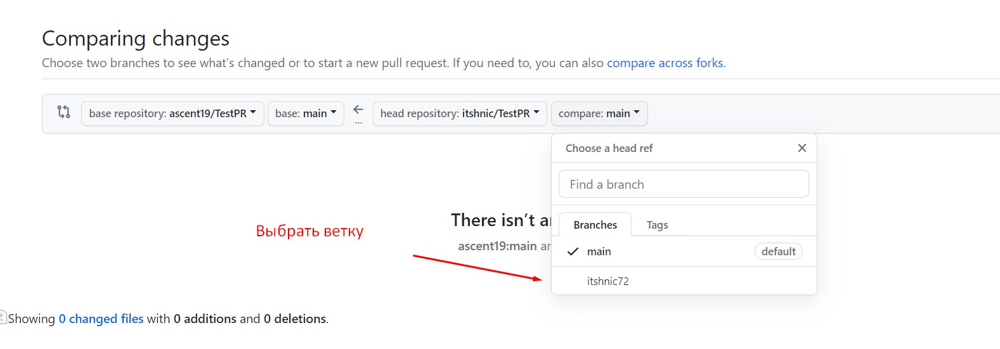

<!--  -->
<image src='git.png' style="margin-left:15px; width:50px;height:50px" alt='logo'>

# Работа с Git 2023

## 1. Проверка наличия git

В терминале вып. команду `git --version` если git установлен появится информ. о его версии.

## 2. Установка git

Загружаем с [сайта](https://git-scm.com/)

## 3. Настройка git

Настройка config -

```Bash
git git config --global user.name "пишем имя"
git config --global user.email "пишем email"
git config --global color.ui "auto" создаем подсветку элементов консоли
git config --list просмотр информации

```

## 4. Инициализация репозитория и работа с локальным репозиторием

В терминале переходим к папке, в которой хотим создать репозиторий

### 4.1 Инициализация/ добавление /сохранение

```Bash
`git init` инициализация
`git add` добавляет инфу в репозиторий
`git commit -m` 'описание коммита'
`git commit -a -m 'описание коммита'` or `git commit -am 'описание коммита'` Добавит инфу и commit! Работает только с ранее добавленным файлом через команду add!!!
`git reset (e28bfd8)` возврат к предыдущему коммиту
`git commit --amend -am` перезаписывает последний коммит
`git reset HEAD~` отмена последнего коммита

```

#### 4.1.1 Ветки

Текущая ветка отмечена звездочкой: **_\*main_**

```Bash
`git branch (название ветки)` создание новой ветки
`git checkout (название ветки)` or `git switch (название ветки)` (переход на новую ветку)
`git checkout -b (название ветки)` or `git switch -c (название ветки)` создаём новую ветку и переключаемся на неё
`git merge (ветка)` находимся на ветке которую изменяем путем слияния
`git branch -d (название ветки)` удаление ветки согласно инструкций git
`git branch -D (название ветки)` удаление ветки принудительно!!!
```

При изменении одного и того-же файла в разных ветках при слиянии возникнет конфликт. При слиянии нужно будет в ручную в VSCode выбрать/согласовать изменения. После - Обязательно!!! сделать коммит слияния.

#### 4.1.2 Просмотр информации

```Bash
`git --version` показывает версию GIT
`git status` Проверяет статус git
`git status -h` Информация о команде status
`git log` Полная история изменения коммитов (выход клавишей Q)
`git log --oneline` Краткая история изменения коммитов
`git log --oneline --all` вся краткая история изменений
`git log --graph` история изменений c визуализацией
`git reflog` история всех операций  в репозитории
`git branch` просмотр веток
`git stash list` просмотр созданых stash (временное хранилище)
`git diff`увидеть разницу между текущим и предыдущим состоянием файла
```

### 4.2 Настройка папки .gitignore

Создаем папку **_.gitignore_** Перечисленные в нем фаилы или шаблоны - дают возможность исключить добавление файлов в репозиторий.
Примеры шаблонов:

```php
`папки` - /node_modules, /packages
`файлы c расширением` - .jpg, .log, .tmp,
`файлы c расширением расположенные в папке`- idea/workspace.xml
`все с данным расширением кроме (отмеченных !)` - *.log
!important.log
`и.т.д` - [ссылка](https://www.atlassian.com/ru/git/tutorials/saving-changes/gitignore#git-ignore-patterns)
```

## 5. Добавление и сохранение в GitHub

---

1. Создать аккаунт на GitHub
2. Создать локальный репозиторий
3. Создать удаленный репозиторий
4. Связать удаленный и локальный репозиторий

---

#### 5.1 Связывание при созданных Локальном и Удаленном репо!

Пишем команды в локальном репо:

```Bash
`git remote add origin (https:// путь к удаленному репо)` подключение удаленного репо к локальному
`git branch -M main` меняем главную ветку в локальном репо на MAIN
`git push -u origin main` выгрузка информ на удаленный репо
```

#### 5.2 Связывание при созданном Удаленном репо - локальный создается по умолчанию.

```Bash
`git clone (ссылка на доступ) (папка/ директория)` - копирует удаленный репо на локальны и создает папку (если папка не указана создаст по умолчанию согласно названия удаленного репо)
`cd (имя новой dir)` - перейти в новую папку
```

#### 5.3 Pull requests GitHub.

---

1. Находим репозиторий в поиске gitHub 
2. Нажимаем кнопку Fork 
3. Создаем копию репозитория в своем аккаунте
4. Создаем локальную копию репозитория <см.п. 5.2> 
5. Создаем новую ветку, в ней работаем над проектом, сохраняем и выгружаем в удаленный репозиторий с помощью команды `git push -u origin (название новой ветки)` - создаем новую ветку в удаленном репо.
6. Создаем Pull requests:

   6.1 Переходим на созданную ветку в удаленном репо

   6.2 Создаем:  или  +  + 

   6.3 Добавляем описание и отправляем

---

#### 5.4 Команды для работы с GitHub.

```Bash
`git (папка/ директория)project`
`git push` выгрузка данных в репозиторий git-hab
`git push --force` перезапись комитов в репозитории
`git pull` скачивает последние обновления ветки
`git fetch` подгружает обновления из репозитория
`git rebase (название ветки из которой берем обновления main)` находимся на ветке которую нужно сместить
`git rebase -i HEAD~(количество комитов которые нужно обьеденить)` в редакторе выбираем подходящие буквы(действия) Выход из редактора Esc :wq
`git push --delete origin (удаление версии 1.0.1)` в репозитории
`git stash` - добавляет фаил во временное хранилище без коммита (можно перейти на другую ветку)
`git stash list` просмотр созданых stash
`git stash push (фаил)` добавляет фаил в созданый stash на этой ветке
`git stash pop` (название stash@{1}) отменяет stash и разворачивает данные для работы (можно отменить сташ на др. ветке и развернуть на нужной
`git cherry-pick` (хеш коммита) переносим коммит на текущую ветку
`git cherry-pick` (название ветки) переносим последний коммит на текущую ветку
`git cherry-pick` ..(название ветки) переносим все коммиты на текущую ветку
```
